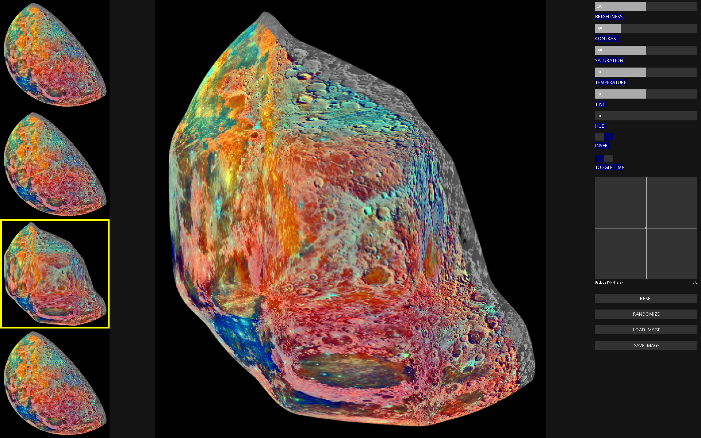

# Oblique for Processing

Oblique for Processing (OfP) is a way of applying pixel transformations to still images. The basic adjustments will be reminiscent of traditional software packages for image editing, but Oblique filters are snippets of code that radically change an image by reorganizing pixels in different ways.

OfP allows you to:

- Import any image.
- Apply basic image adjustments, color shifts, and inversions.
- Utilize Oblique filters (which are really OpenGL ES GLSL fragment shaders) to rearrange the pixels of your image.
- Randomize all parameters.
- Export your image back to your file system.

This proejct is based on [an iOS app](http://appstore.com/obliqueanewwaytophotograph) I released in 2017 which enables real-time filtering of your camera feed. This project is a port of that project into Processing to create an environment for filtering high resolution digital images captured with any camera and/or found on the internet.

## Who uses Oblique for Processing?

OfP is meant to be used for anyone curious about manipulating the pixels of their images. This could be media artists, photographers, creative coders, or people getting started with computer graphics.

Another audience may be people who are interested in learning OpenGL ES GLSL fragment shaders. There are many resources to learn online. Among them are:

- [The Book of Shaders](https://thebookofshaders.com/)
- [Shadertoy](https://www.shadertoy.com/)

## How does Oblique work?

The basic premise of oblique is the idea that if you chain enough fragment shaders together, that you can allow users to create interesting effects.

Oblique has a chain system that looks like this:



The order of the shaders matters, so you will notice some unique behavior that is affected by this chain. For example, a saturation change will not affect a hue change because saturation is higher up in the chain.

## Interface



## Can I use this source code for my projects?

Because OfP is released under a GPL 3.0 license, you are free to modify the source code and use it for your projects with some caveats.

If you intend to ditribute your modified version of this code, you are required to open-source and release any modifications to the community, as well as document your changes.

Here's a great TLDR of GPL3 ([Source](https://gist.github.com/kn9ts/cbe95340d29fc1aaeaa5dd5c059d2e60)):

```
1. Anyone can copy, modify and distribute this software.
2. You have to include the license and copyright notice with each and every distribution.
3. You can use this software privately.
4. You can use this software for commercial purposes.
5. If you dare build your business solely from this code, you risk open-sourcing the whole code base.
6. If you modify it, you have to indicate changes made to the code.
7. Any modifications of this code base MUST be distributed with the same license, GPLv3.
8. This software is provided without warranty.
9. The software author or license can not be held liable for any damages inflicted by the software.
```

## Acknowledgements

OfP was developed in Prof. Jennifer Jacobs course *Computational Systems for Visual Art and Design* in UC Santa Barbara's Media Art & Technology course. I received generous feedback in this course from Prof. Jacobs, as well as my peers Ashley DelValle, Suriya Dakshina Murthy, and our TA, Stejara Iulia Dinulescu.

Thank you to Adam Ferriss for helping get the shader chain up and running and the overall Processing community.

And thank you to Andreas Schlegel, who developed Control P5 which Oblique uses for its UI.

OfP's default image of the false color moon was created by NASA/JPL (Public domain, via Wikimedia Commons).